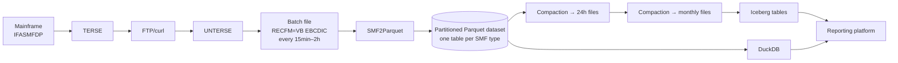
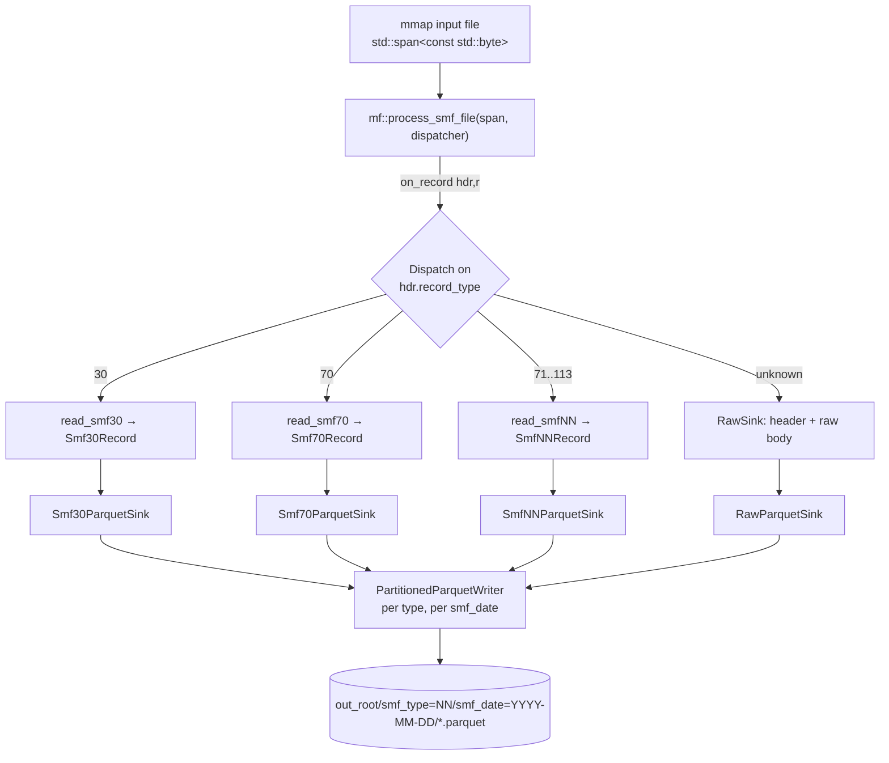
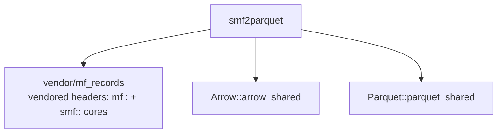

# SMF2Parquet — Design

## 1. Purpose

Convert a downloaded SMF log (IBM mainframe System Management Facility data) into
Parquet, **splitting the single mixed-record-type stream into one Parquet table per
SMF record type**. The Parquet output feeds a reporting platform built on **DuckDB /
Apache Iceberg** (and possibly other engines).

Each batch of SMF data arrives on a cadence (as often as every 15 minutes, up to every
~2 hours). SMF2Parquet processes one batch file per run and emits Parquet files into a
partitioned dataset. Downstream routines later compact those into 24-hour files and then
monthly files — so this tool must be **append-friendly (new files, never in-place
mutation)** and produce **stable, mergeable schemas**.

### Goals
- One Parquet table per SMF record type, with typed, analyst-friendly columns.
- Reuse the existing parsing code rather than re-deriving SMF layouts.
- Output that DuckDB and Iceberg can consume directly (proper temporal types,
  Hive-style partitioning, one logical table per type).
- Lossless coverage: every record in the input is accounted for (parsed, or captured as
  raw bytes if its type has no parser).

### Non-goals (v1)
- Writing Iceberg table metadata directly (we write Parquet data files; an external
  catalog/loader registers them — see §7.4).
- The downstream 24h / monthly compaction routines (separate tools).
- High-throughput multithreading (single-threaded v1; scaling path in §8).

---

## 2. Relationship to the two existing libraries

| Library | Path | What we take |
|---|---|---|
| **MF-records-to-C** | `G:\projects\MF-records-to-C` | Header-only C++23 parsing core: `mf::Reader` (packed/zoned/EBCDIC/IBM-float/date/time/TOD), `smf_reader.h` (20-byte header), `smf_file_reader.h` (`process_smf_file` RECFM=VB loop), `smf_sink.h` (sink concepts). **Crucially, it already contains a working SMF→Parquet path** — `sinks/smf30_parquet_sink.h` + `tools/smf_to_parquet.cpp` — which is the structural template for every type's sink. |
| **SMF-parser** | `G:\projects\SMF-parser` | The "split by record type" architecture (mmap → `read_rdw` loop → dispatch on the type byte at offset 3) and **13 per-type record parsers** in `src/smf*_reader.h` (types 30, 70, 71, 72, 73, 74, 75, 76, 77, 78, 79, 99, 113) plus the shared triplet helper `smf_section.h`. Its back end targets ClickHouse; we replace that back end with Parquet. |

### The reusable pattern

In SMF-parser each type follows the same shape (`src/main.cpp`, `src/smf_worker.h`):

```cpp
read_smfNN(rec_bytes)            // -> SmfNNRecord   (pure parse, mf:: only)
SmfNNRow::from_record(record)    // -> std::vector<SmfNNRow>   (flattened, 1..N rows)
row.to_rowbinary(buf)            // -> ClickHouse RowBinary   (this is the part we drop)
```

`read_smfNN` + `SmfNNRecord` are **backend-neutral** (they depend only on `mf::Reader`,
`smf_reader.h`, `smf_section.h`). Only `SmfNNRow` / `to_rowbinary` is ClickHouse-specific.
The Parquet sink replaces that last step: it maps a parsed record (1→N rows) into Arrow
columnar builders, exactly as `smf30_parquet_sink.h` already does for type 30.

> ⚠️ **Accuracy caveat.** The SMF-parser readers (70–113 especially) are structurally
> complete but full of `TODO: verify offsets against IBM GA32-0869 / SMF Explorer`. Field
> *positions* are best-effort. Validating them against the IBM SMF Explorer mappings
> (https://ibm.github.io/IBM-SMF-Explorer/mappings/) and real data is a first-class work
> item (§12), not an afterthought.

---

## 3. End-to-end pipeline



SMF2Parquet owns only the `F → DS` step. Compaction and catalog registration are
separate downstream routines.

---

## 4. Input format (recap)

RECFM=VB binary, EBCDIC, big-endian, one 4-byte RDW per record. The standard 20-byte SMF
header (`mf::read_smf_header`) gives `record_type` (the routing key, byte 3),
`record_len`, `flags`, `time` (`MfTime`), `date` (`MfDate`), `system_id`, `subsystem_id`.
Types 30/70/72/74/… carry a `uint16` subtype at offset 20, then 12-byte triplets
(`offset/length/count`) pointing to variable sections. All of this is already handled by
the MF-records-to-C reader and the SMF-parser `smf_section.h` helper.

---

## 5. Architecture



### 5.1 Components

| Component | New/Reused | Responsibility |
|---|---|---|
| `MmapFile` | Reuse from `tools/smf_to_parquet.cpp` | mmap the input file → `std::span<const std::byte>`. |
| File loop | Reuse `mf::process_smf_file` | RECFM=VB outer loop; read RDW + 20-byte header; call `dispatcher.on_record(hdr, r)`. |
| `ParquetDispatcher` | New | `switch (hdr.record_type)`: route to the matching `read_smfNN` + sink; default → `RawSink`. Owns all sinks. |
| `read_smfNN` + `SmfNNRecord` | Reuse (decoupled) | Pure parse, `mf::`-only. See §6 for how we obtain a ClickHouse-free copy. |
| `SmfNNParquetSink` | New (1 per type) | Map a parsed record (1→N rows) into Arrow builders; flush batches; modeled on `smf30_parquet_sink.h`. |
| `RawSink` / `RawParquetSink` | New | For types with no dedicated parser: emit a generic table (header columns + raw EBCDIC body as `binary`). Guarantees lossless coverage. |
| `PartitionedParquetWriter` | New | Bucket rows by `(record_type, smf_date)`; one open Arrow `FileWriter` per partition; atomic temp-then-rename on close. |
| `Stats` | New | Per-type record/row counts, dropped/malformed counts, unknown-type counts; printed on exit. |
| `main.cpp` | New (adapts the tool) | Parse CLI/config; wire mmap → dispatcher → writer; report stats; exit codes. |

### 5.2 Sink shape (per type)

Modeled directly on `mf::Smf30ParquetSink` (`MF-records-to-C/sinks/smf30_parquet_sink.h`):

```cpp
class Smf70ParquetSink {
public:
    static std::shared_ptr<arrow::Schema> schema();   // static — column contract
    void write(const smf::Smf70Record& rec);          // appends 1..N rows
    void flush(PartitionedParquetWriter& w);           // hands finished batches to writer
};
```

Two differences from the existing type-30 sink:
1. **1→N rows.** `write()` may append several rows (e.g. type 74/75 emit one row per
   device). Builders append in a loop over the record's section entries.
2. **Partition-aware.** Rows are routed to the writer keyed by `(type, smf_date)` rather
   than to a single fixed output file, because one batch can straddle midnight.

A small **codegen-friendly macro / X-list** describes each type's columns once so the
schema, the builders, and the append calls stay in sync (reduces the per-type boilerplate
that the hand-written type-30 sink repeats three times).

---

## 6. Key decision — how to reuse the 13 parsers (needs sign-off)

The SMF-parser readers `#include "ch_batch.h"` because their `SmfNNRow`/`to_rowbinary`
members are ClickHouse-specific. We need the *parsing* (`read_smfNN` + `SmfNNRecord`)
without that dependency. Three options:

| Option | What it is | Pros | Cons |
|---|---|---|---|
| **A. Promote parsers into MF-records-to-C** *(recommended)* | Move the pure-parse halves (`SmfNNRecord`, section parsers, `read_smfNN`) into `MF-records-to-C/smfNN_reader.h`. SMF-parser keeps `SmfNNRow`+`to_rowbinary` (includes the shared reader + `ch_batch.h`); SMF2Parquet adds `smfNN_parquet_sink.h` (includes the shared reader + Arrow). | Single source of truth; both back ends (ClickHouse, Parquet) share one parser; matches MF-records-to-C's stated purpose ("translate MF records to C"). Bug-fixes/offset corrections benefit everyone. | Touches two other projects; requires splitting each reader into parse-core vs CH-row. |
| **B. Vendor copies into SMF2Parquet** | Copy the 13 readers into `SMF2Parquet/readers/`, delete the `SmfNNRow`/`to_rowbinary` parts and the `ch_batch.h` include. | Self-contained; no edits to other repos; fastest to start. | Parser logic duplicated → drifts from SMF-parser over time; offset fixes must be applied twice. |
| **C. `ch_batch` shim** | Keep including the SMF-parser readers as-is; provide a tiny header that satisfies the `ch::` symbols they reference, ignore the `SmfNNRow` types, call only `read_smfNN`. | No edits to readers. | Fragile coupling to SMF-parser internals; drags dead ClickHouse-shaped code into the build; brittle if `ch_batch.h` changes. |

**Recommendation: Option A.** It is the only one that avoids long-term divergence and it
fits the existing project boundaries (MF-records-to-C = parsing, back-end projects =
sinks). If touching the other two repos is undesirable right now, **Option B** is the
pragmatic fallback and can be migrated to A later. This is the one decision that should be
confirmed before implementation starts.

---

## 7. Output design (DuckDB / Iceberg)

### 7.1 One table per record type
Each SMF type is its own logical table (`smf30`, `smf70`, …, plus `smf_raw` for
unparsed types). This matches the intent, keeps per-type schemas tight, and maps 1:1 onto
Iceberg tables.

### 7.2 Partition layout (Hive-style)
```
<out_root>/
  smf_type=30/
    smf_date=2026-05-28/
      smf30-20260528T1015Z-<runid>-0001.parquet
  smf_type=70/
    smf_date=2026-05-28/
      smf70-20260528T1015Z-<runid>-0001.parquet
  smf_type=raw/
    smf_date=2026-05-28/
      raw-...
```
- `smf_type` and `smf_date` are Hive partition keys. DuckDB:
  `SELECT * FROM read_parquet('out_root/smf_type=30/**/*.parquet', hive_partitioning=true)`.
- `smf_date` is derived from each record's SMF header date, so a near-midnight batch
  correctly splits across two date partitions.
- File name carries batch timestamp + run id + sequence → globally unique, traceable, and
  collision-free across the 15-min/2-h runs. No file is ever rewritten in place.

### 7.3 Atomicity & idempotency
- Write each file to `*.parquet.tmp`, then atomic `rename` on successful close, so readers
  never see a half-written file and a crashed run leaves no partial visible output.
- Each output row carries lineage columns (`source_file`, `ingest_ts`, and ideally a
  record sequence) so downstream compaction can de-duplicate if a batch is reprocessed.

### 7.4 Iceberg path
v1 writes plain Parquet data files in the layout above. An Iceberg table per type is
populated by either (a) `add_files` / a metadata loader pointing at these Parquet files,
or (b) the downstream compaction routine writing Iceberg directly. Keeping schemas stable
and additive (§9) is what makes this clean.

### 7.5 Type mapping (improves on the type-30 example)

The existing `smf30_parquet_sink.h` stores dates as `int32` YYYYMMDD and times as `double`
seconds. For a DuckDB/Iceberg reporting platform we use **native temporal types** instead:

| SMF / parsed type | Arrow / Parquet type | Notes |
|---|---|---|
| Header date+time | `timestamp[us, tz=UTC]` `smf_timestamp` | Combined; the primary event time. |
| Header date | `date32` `smf_date` | Partition key. |
| Interval start/end | `timestamp[us, tz=UTC]` | RMF records. |
| TOD clock | `timestamp[us, tz=UTC]` | via `tod_to_unix`. |
| `PIC S9 COMP-3` scale 0 / COMP | `int16/int32/int64` | per width. |
| `PIC S9V9 COMP-3`, COMP-1/2 | `float64` (`float32` for COMP-1) | |
| `PIC 9 COMP` unsigned | `uint16/uint32/uint64` | |
| EBCDIC `PIC X(n)` | `utf8` (rtrimmed); low-cardinality fields → `dictionary<utf8>` | `system_id`, `subsystem_id`, model strings. Parquet dictionary-encodes regardless. |
| Flag byte | `uint8` | |
| Raw record body (`smf_raw`) | `binary` | EBCDIC, untouched. |

### 7.6 Common columns (every table)
`smf_timestamp`, `smf_date`, `system_id`, `subsystem_id`, `record_type`, `subtype`,
`flags`, plus lineage `source_file`, `ingest_ts`. Type-specific columns follow. Column
**order is fixed and documented per type** (Iceberg/Parquet schema stability).

### 7.7 Compression
ZSTD (level ~3) for the reporting dataset — better ratio than the Snappy the type-30
example uses, and fine for batch writes. Row-group size tuned (~128 MB target) but batches
may be small; the downstream compaction step is where big row groups are formed.

---

## 8. Threading model

**v1 is single-threaded** — one pass: mmap → `process_smf_file` → dispatch → per-type
sink → partitioned writer. Rationale: per-batch files are modest (15-min/2-h windows),
Arrow `FileWriter`s are not freely shareable across threads, and correctness/validation of
the parsers is the dominant risk, not throughput.

**Scaling path (later):** reuse SMF-parser's `SpscQueue` (`src/spsc_queue.h`) + per-type
worker model (`src/smf_worker.h`) — the file reader thread dispatches raw record spans to
per-type queues, each drained by a worker that owns its sink/partition writer. This drops
in without changing the parser or sink layer.

---

## 9. Schema management & evolution

- One schema definition per type, **column order fixed**, kept in code (the static
  `schema()` on each sink) and mirrored in human-readable form. The SMF-parser
  `schema/smfNN.sql` files are a useful cross-reference for column intent.
- Evolution is **additive only** (append new nullable columns at the end) so older Parquet
  files remain readable and Iceberg schema evolution stays trivial.
- A `schema_version` is recorded (file metadata / a column) so the reporting layer can
  reason about mixed-vintage files during the compaction window.

---

## 10. Error handling & observability

- Malformed record (RDW overruns, header < 20 bytes): skip, increment `malformed`
  counter, continue — never abort the whole file. (`process_smf_file` already skips
  truncated records.)
- Unknown / unparsed type: routed to `smf_raw` (lossless) and counted.
- Parser exceptions: caught per-record; record routed to `smf_raw` with an error flag;
  counted. One bad record never loses the batch.
- Exit summary: per-type record + row counts, raw/unknown counts, malformed counts, bytes
  read, wall time. Non-zero exit only on I/O / write failure.

---

## 11. Build & dependencies

- **Toolchain:** WSL Ubuntu 24.04, GCC 13.3, CMake 3.28. C++23.
- **Standalone:** SMF2Parquet has **no sibling-project dependency**. The `mf::` reader
  primitives and `smf::` parse cores are **vendored** under `vendor/mf_records/` (a copy of the
  header-only MF-records-to-C library — see `vendor/mf_records/SYNC.md`). The implementation
  thus diverges from the §6 "Option A" plan: this project owns its copy of the cores.
- **Apache Arrow + Parquet C++** — installed in WSL (24.0.0 via the Apache APT repo;
  Ubuntu noble has no `libarrow-dev` in universe). Required **only** for the sink layer; the
  parsing path builds without them. CMake finds them via `find_package(Arrow/Parquet CONFIG)`.
- Build:
  ```bash
  # parse + counts only (no Arrow):
  wsl -e bash -c "cd /mnt/g/projects/SMF2Parquet && cmake -B build && cmake --build build"
  # with the Parquet sink layer:
  wsl -e bash -c "cd /mnt/g/projects/SMF2Parquet && cmake -B build -DSMF2PARQUET_WITH_PARQUET=ON && cmake --build build"
  ```



---

## 12. Testing & validation

1. **Synthetic SMF generation** — reuse / extend `SMF-parser/tests/gen_test_smf.cpp` to
   produce small RECFM=VB files with known field values for each type.
2. **`static_assert` parser tests** — follow MF-records-to-C's compile-time test style for
   any new conversion helpers.
3. **Golden Parquet** — convert a synthetic file, read it back with Arrow, assert columns
   and values; commit a tiny reference dataset.
4. **DuckDB round-trip** — query the output with DuckDB in CI
   (`SELECT count(*), ... GROUP BY` per type) to prove it's consumable as intended.
5. **Field-offset verification** — for each type, check parsed values against the IBM SMF
   Explorer mappings and (where available) a real captured record; clear the `TODO: verify
   offsets` notes type by type. **This is the largest correctness task.**
6. **Edge cases** — empty file, truncated final record, midnight-straddling batch (two date
   partitions), unknown record type → `smf_raw`.

---

## 13. Assumptions & open items

- **Assumed:** input is post-UNTERSE RECFM=VB with RDW (per SMF-parser ARCHITECTURE.md);
  one input file per run; CP037 EBCDIC default.
- **Decision needed (§6):** reuse strategy A vs B vs C for the 13 parsers.
- **To confirm:** ZSTD vs Snappy for the reporting dataset; whether `smf_date` partition
  should also include hour for the 15-min cadence (likely day is enough; compaction handles
  the rest).
- **Deferred:** multithreading (§8); direct Iceberg metadata writing (§7.4); the 24h/monthly
  compaction tools.
