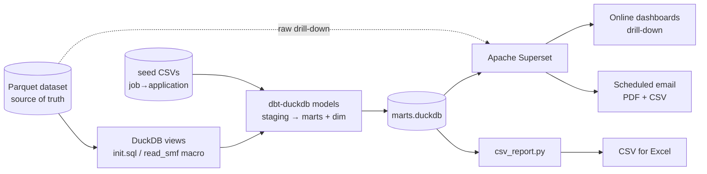
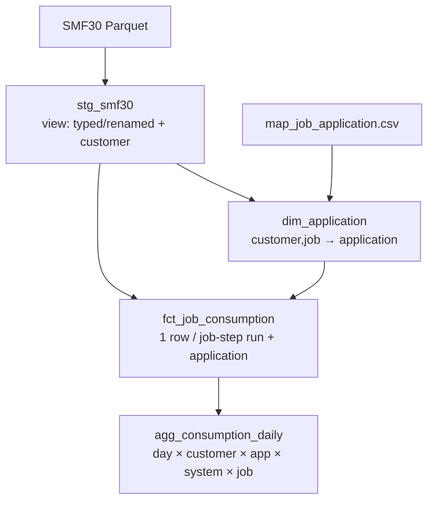

# SMF Reporting & Analysis — Design

Companion to the ingest-side [`../DESIGN.md`](../DESIGN.md). That document covers
**collection** (SMF log → one Parquet table per record type). This document covers
the **reporting and analysis layer** built on top of that Parquet dataset.

Operational how-to (bring-up commands, dashboard steps) lives in
[`README.md`](README.md); this is the architecture and the *why*.

---

## 1. Purpose

Turn the SMF2Parquet output into something people can use:

- **Online, interactive analysis with drill-down** for technicians — find large
  consumers and performance problems (customer → application → job → step).
- **Customer-facing consumption reporting** — show each customer/application what
  their mainframe is doing and what it costs.
- **Scheduled, predefined reports by email** — PDFs with graphs *and* plain CSV
  for Excel.
- **User-defined dashboards.**
- A first-class **metadata extension point** — map jobs (later CICS transactions,
  DB2 objects) to a business *application*, owned by the user, without re-ingest.

### Goals
- Read the Parquet **source of truth** directly; never copy or mutate it.
- All-freeware/OSS by default; keep the door open to commercial engines later.
- Reports get richer automatically as more SMF types are field-verified upstream.
- Self-serve SQL for analysts *and* curated dashboards for stakeholders.

### Non-goals
- The 24h/monthly Parquet **compaction** routines (ingest-side, separate tools).
- Writing Iceberg catalog metadata (optional future; see §9).
- A bespoke web app — we use an off-the-shelf BI tool (Superset), not custom UI.

---

## 2. Relationship to SMF2Parquet

The contract between the two layers is the **on-disk Parquet dataset** and its
column conventions only. The reporting layer has no build-time dependency on the
C++ project and could be moved to its own repo unchanged.

| | Ingest (SMF2Parquet) | Reporting (this layer) |
|---|---|---|
| Owns | RECFM=VB → typed Parquet, one table per type | DuckDB views, dbt marts, Superset, exports |
| Language | C++23 + Arrow | SQL (DuckDB / dbt) + a little Python |
| Reads/writes | writes Parquet | reads Parquet; writes `marts.duckdb`, CSV/PDF |
| Coupling point | the dataset layout (§3) + common columns | same |

### On-disk dataset layout (the actual contract)

Produced by `src/sinks/partitioned_table.h`:

```
<data_root>/<customer>/<system_id>/year=YYYY/month=MM/<TYPE>-<YYYYMMDD>-<run_id>.parquet
```

- `customer`, `system_id` — plain directory names (**not** hive `key=value`).
  `system_id` is also a stored column; `customer` is **path-only**.
- `year`, `month` — hive partition keys.
- `<TYPE>` — uppercase table name used as a **filename prefix** (`SMF30`, …, `RAW`),
  not a directory.

> ⚠️ This differs from the ingest `DESIGN.md` §7.2 (`smf_type=…/smf_date=…`); the
> code is the source of truth. The reporting layer reads via
> `read_parquet('<root>/**/SMF30-*.parquet', hive_partitioning=true, filename=true)`
> and recovers `customer` from the path with
> `regexp_extract(filename, '([^/]+)/([^/]+)/year=', 1)`.

### Common columns relied on (every table)
`smf_timestamp`, `smf_date`, `system_id`, `subsystem_id`, `record_type`,
`subtype`, `flags`, `source_file`, `ingest_ts` (see ingest `common_columns.h`).
Type-30 adds `job_name`, `step_name`, `job_id`, `program_name`, `cpu_sec`,
`tcb_sec`, `srb_sec`, `ziip_sec`, `elapsed_sec`, `excp_count`.

---

## 3. Architecture



Three serving paths, one source of truth:
1. **Ad-hoc SQL** — DuckDB CLI over the Parquet (analysts, zero server).
2. **Curated** — dbt marts in `marts.duckdb`, served by Superset (dashboards,
   drill-down, scheduled reports).
3. **Headless** — `csv_report.py` for CSV feeds on cron.

### 3.1 Components

| Component | Tech | Responsibility |
|---|---|---|
| `duckdb/init.sql` | DuckDB | `read_smf(type)` macro + one view per SMF type over the Parquet glob; recovers `customer`/`year`/`month`. Analyst self-serve. |
| `dbt/` project | dbt-duckdb | staging views → fact/aggregate marts + `dim_application`; data tests; builds `marts.duckdb`. |
| `dim_application` + seeds | dbt + CSV | the metadata mapping layer (§5). |
| `superset/` | Superset + Docker | dashboards, drill-down, async query, scheduled PDF/CSV email. Image adds the DuckDB driver + Chromium. |
| `docker-compose.yml` | Compose | Superset + Postgres (metadata) + Redis (broker) + worker + beat. |
| `exports/csv_report.py` | Python + DuckDB | headless CSV export for Excel; cron-friendly. |

### 3.2 Why DuckDB is the engine
- Reads the Hive-partitioned Parquet directly, no load step.
- Embedded/serverless; the marts are a single file.
- **Concurrency model:** DuckDB is single-writer but **multi-reader when opened
  read-only**. dbt is the only writer (rebuilds `marts.duckdb`); Superset and
  `csv_report.py` open it `access_mode=read_only`. This keeps a single-box stack
  multi-user without a heavyweight SQL server.

---

## 4. Data model (marts)

Two-layer dbt model; column intent matches ingest `smf30_parquet_sink.h`.



| Model | Materialization | Grain | Use |
|---|---|---|---|
| `stg_smf30` | view | 1 row / SMF30 record | typing, renaming, `customer` from path |
| `dim_application` | table | 1 row / (customer, job_name) | business mapping (§5) |
| `fct_job_consumption` | table | 1 row / job-step run | drill-to-detail in dashboards |
| `agg_consumption_daily` | table | day × customer × app × system × job | fast dashboards + scheduled report |

**Measures** (type-30, native seconds): `cpu_sec` (GP = `tcb_sec`+`srb_sec`),
`ziip_sec` (offload), `elapsed_sec`, `excp` (I/O). **Dimensions:** `smf_date`,
`customer`, `application`, `app_group`, `system_id`, `job_name`/`step_name`/
`program_name`.

**Evolution:** marts are rebuilt each run, so schema changes are cheap; the
`read_smf` macro uses `union_by_name` so additive Parquet schema changes upstream
don't break reads. New SMF types become new `stg_` + `fct_`/`agg_` models.

---

## 5. The metadata mapping layer (key design point)

The user must be able to add their own meaning — "these jobs are the *Billing*
application for customer *ACME*" — without changing ingest or re-processing SMF.

Design:
- **Editable seed CSVs** (`seeds/map_job_application.csv`): glob pattern →
  `application` + `app_group`. Versioned in git, owned by the user/analyst.
- **`dim_application`** resolves each distinct `(customer, job_name)` against the
  seed. Multiple patterns may match a job; the **most specific (longest pattern)
  wins**; unmatched → `(unmapped)` so nothing is hidden and gaps are visible.
- **`fct_job_consumption`** joins the dimension, so every row carries its
  application. Re-mapping is just `dbt seed && dbt run` — seconds, no re-ingest.

```
edit map_job_application.csv  →  dbt seed && dbt run  →  dashboards/CSV re-map instantly
```

**Extensibility:** when CICS (SMF 110) and DB2 (SMF 100–102) parsing land
upstream, add `stg_smf110` + `map_cics_application.csv` (txn → application) and
UNION it into `dim_application`. The fact/aggregate layer and dashboards extend
with no rework. The mapping is *additive* and lives entirely in the reporting
layer.

---

## 6. Reports & dashboards

Grounded in today's field-verified data (SMF 30 = consumption). Each is built on a
mart, not raw Parquet, for speed.

1. **Customer Consumption** (online, drill-down): `SUM(cpu_sec)`/`ziip_sec` over
   time, broken down by application; drill customer → application → job → step
   (`fct_job_consumption`). Filters: customer, system, date range.
2. **Top Consumers / anomalies**: top-N jobs by CPU, high-EXCP jobs, biggest
   day-over-day movers — the technician "who/what is heavy" view.
3. **Scheduled consumption report** (emailed): Superset Report → **PDF** with
   charts per customer + **CSV** attachment of the same numbers for Excel.
4. **System utilization** (RMF 70–79): added once upstream field-offset
   verification makes those columns trustworthy (ingest `DESIGN.md` §12 / TODO
   Phase 7). Until then those types are header-only stubs and are intentionally
   not surfaced.

CSV-for-Excel is available three ways: Superset chart "Export to CSV", the
scheduled-report CSV attachment, and the standalone `csv_report.py` (cron).

---

## 7. Scheduling (deliberately primitive)

Two independent schedulers, both freeware:
- **Superset Alerts & Reports** (Celery beat in the compose stack) — fires the
  emailed PDF/CSV dashboard reports; cron expression per report, set in the UI.
- **OS cron** ([`exports/crontab.example`](exports/crontab.example)) — rebuilds
  the dbt marts after new SMF batches land, and runs the headless CSV pack.

No orchestration engine (Airflow/Dagster) in v1; a cron line per job is enough at
this cadence. The marts rebuild is idempotent, so a missed/retried run is safe.

---

## 8. Deployment

- **Host:** Docker Compose on WSL/Linux (matches the existing build env).
- **Containers:** `superset` (web), `superset-worker` (async + report render),
  `superset-beat` (schedule), `superset-init` (one-shot DB upgrade + admin +
  register the DuckDB connection), `postgres` (Superset's own metadata DB — *not*
  the analytics data), `redis` (Celery broker + cache).
- **Mounts:** `marts.duckdb` read-only (analytics), the Parquet `data_root`
  read-only (raw drill-down), `superset_config.py`.
- **Secrets/config:** all via `.env` (`.env.example` is the template); nothing
  secret is committed. SMTP and the public URL are env-driven.
- **Image:** extends `apache/superset` with `duckdb` + `duckdb-engine` and
  Chromium (for PDF/PNG rendering of dashboards).

---

## 9. Open-format escape hatch (commercial-tool friendliness)

The pipeline keeps **open Parquet (→ Iceberg) as the source of truth and SQL as
the contract** — nothing proprietary in the middle. Consequences:
- Any engine can be added beside DuckDB: **Trino, Spark, Dremio, ClickHouse**,
  or a commercial BI tool, all read the same Parquet/Iceberg.
- **Iceberg** is optional and additive: register the existing Parquet via a
  catalog (`add_files`) or have the downstream compaction write Iceberg directly;
  dbt/Superset are unchanged. Adopt when scale or multi-engine governance needs it.
- A later switch of BI tool (e.g. to a commercial product) re-points at
  `marts.duckdb`/Parquet; the dbt model layer carries over.

---

## 10. Testing & validation

- **dbt data tests** (`schema.yml`): `not_null`/`unique` on keys, surrogate key
  uniqueness on `dim_application`, measures non-null on the marts. `dbt build`
  runs them every build.
- **Round-trip smoke**: build the bundled fixture (`gen_test_smf` →
  `smf2parquet`), `dbt build`, `csv_report.py` — asserts the chain is wired.
- **Mapping test**: inject a record with a known job name, confirm it resolves to
  the expected application after `dbt run` (verified: `PROD001 → Billing`).
- **Value-level accuracy** depends on upstream: the synthetic generator emits
  empty job bodies (zero CPU), so values are placeholders until real SMF data /
  richer fixtures (ingest TODO Phase 9) and field-offset verification (Phase 7).

---

## 11. Assumptions & open items
- **Assumed:** `customer` is meaningful in the output path; the SMF30 sink threads
  a `customer` arg — confirm it is populated per tenant as intended (else
  `customer` is a single constant and the real tenant lives only in the
  application map).
- **Decision (later):** add an hour grain to marts if 15-min cadence needs
  intra-day reporting (day is enough today; compaction handles the rest).
- **Deferred:** RMF/utilization marts (await Phase 7); CICS/DB2 application
  mapping (await those parsers); Iceberg registration (§9); orchestration beyond
  cron.
```
